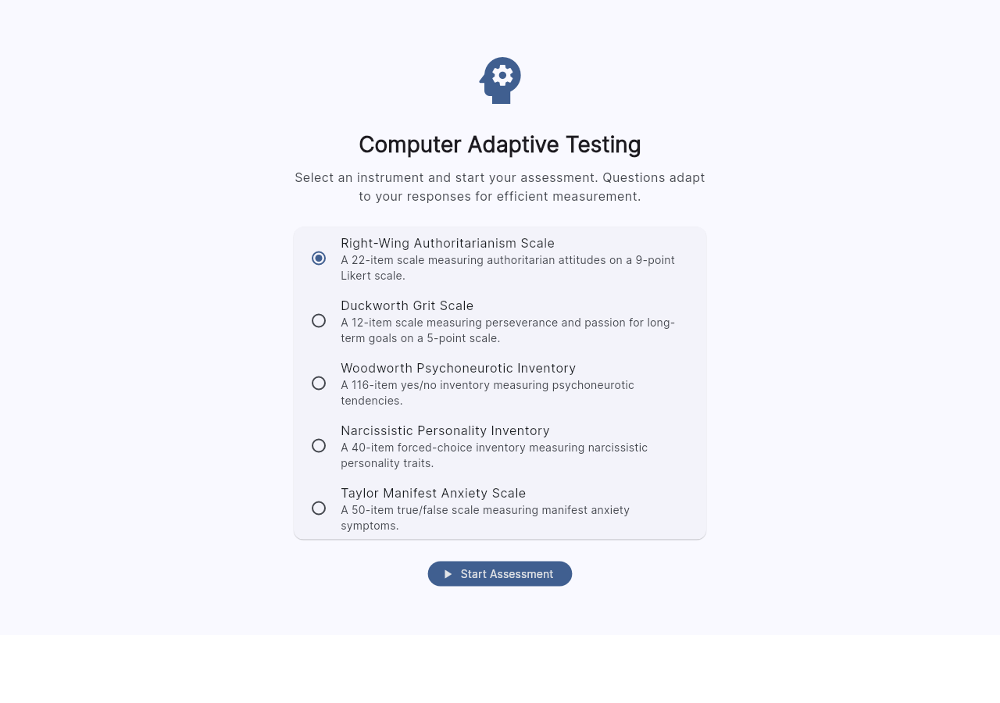
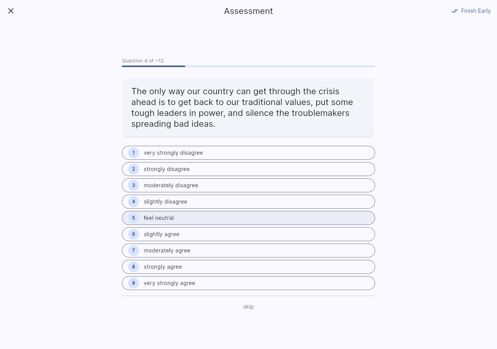
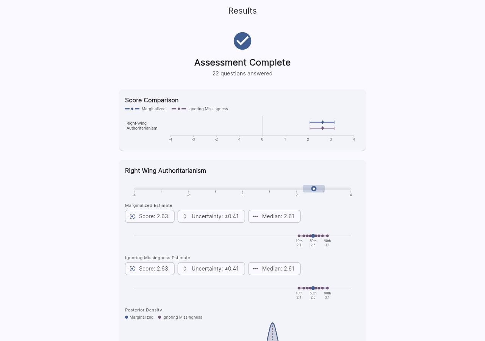

#  Go(lang)FlutterCAT

Computer adaptive testing (CAT) platform with a Go backend (IRT engine + REST API), an embedded server-rendered HTML frontend (gomponents + htmx), and a Flutter frontend.

When provided, the scoring algorithm marginalizes against a MiceBayesianLOO model for performing "imputation" on unobserved item responses. Doing so keeps the score consistent without assuming that the IRT model is well-specified.

### Item Selection Strategies

The following selectors are included:
- Fisher information maximization (greedy)
- Posterior variance minization (greedy)
- "Global information" (greedy)
- KL Divergence (greedy)
- Cross-entropy (stochastic)

The stochastic cross entropy selector was derived in [arXiv:2504.15543](https://arxiv.org/abs/2504.15543) for having the frequentist item sampling statistics correspond to performing Bayesian model averaging in ability space.
  






## Quick Start

### Prerequisites

- Go 1.25+
- Flutter SDK 3.11+

### Start the Server

```bash
go run . server
```

On startup the server prints:

```
  Frontend:  http://localhost:19401/
  API Docs:  http://localhost:19401/docs
  Example:   curl http://localhost:19401/instruments
```

The **embedded HTML frontend** is served at `/` — no separate build step, no Node.js, no Flutter SDK required. Just a single Go binary.

Configuration is loaded from `backend-golang/config/config-default.yml`. Override with environment variables:

```bash
PORT=8080 go run . server                # change the listen port
APP_ENV=production go run . server       # load production config
```

### Flutter Frontend (optional)

A richer Flutter frontend is also available:

```bash
cd frontend-flutter
flutter pub get
flutter run -d chrome                    # web
flutter run                              # default device
```

To point the Flutter frontend at a different backend:

```bash
flutter run --dart-define=API_BASE_URL=http://192.168.1.10:19401
```

### Bundled Instruments

The backend ships with five embedded instruments — no extra configuration needed:

| Instrument | Items | Response Format | Scale |
|------------|-------|----------------|-------|
| Right-Wing Authoritarianism (RWA) | 22 | 9-point Likert | Right-Wing Authoritarianism |
| Duckworth Grit Scale | 12 | 5-point Likert | Grit |
| Narcissistic Personality Inventory (NPI) | 40 | Binary forced-choice | Narcissism |
| Taylor Manifest Anxiety Scale (TMA) | 50 | True/False | Anxiety |
| Woodworth Psychoneurotic Inventory (WPI) | 116 | Yes/No | Psychoneurosis |

Each instrument includes a MICE Bayesian LOO imputation model for Rao-Blackwellized scoring under non-ignorable missingness. The frontend displays an instrument selector on startup.

## API Endpoints

| Method | Path | Description |
|--------|------|-------------|
| `GET` | `/instruments` | List available instruments |
| `GET` | `/assessment?instrument=X` | Assessment metadata (name, description, scales, CAT config) |
| `POST` | `/session` | Create a new CAT session (`{"instrument": "grit"}`) |
| `GET` | `/session` | List active session IDs |
| `GET` | `/{sid}/item` | Get next item (adaptive selection across scales) |
| `GET` | `/{sid}/{scale}/item` | Get next item for a specific scale |
| `POST` | `/{sid}/response` | Submit a response (`{"item_name": "Q1", "value": 3}`) |
| `GET` | `/{sid}` | Get session summary with scores |
| `DELETE` | `/{sid}` | Deactivate session |

## Defining a New Assessment

An assessment consists of **item files** (the questions), **scale definitions**, and a **config entry** that ties them together.

### 1. Item Files

Each item is a JSON file with this structure:

```json
{
  "item": "PHQ1",
  "question": "Over the last 2 weeks, how often have you had little interest or pleasure in doing things?",
  "responses": {
    "0": {"text": "Not at all", "value": 0},
    "1": {"text": "Several days", "value": 1},
    "2": {"text": "More than half the days", "value": 2},
    "3": {"text": "Nearly every day", "value": 3}
  },
  "scales": {
    "depression": {
      "discrimination": 2.1,
      "difficulties": [-1.5, 0.3, 1.8]
    }
  }
}
```

Key fields:
- **`item`**: Unique item identifier
- **`question`**: The text shown to the respondent
- **`responses`**: Map of response options. Each has `text` (label) and `value` (numeric score). Use value `0` for a skip option.
- **`scales`**: IRT calibration parameters per scale this item loads on.
  - **`discrimination`**: How well this item differentiates between ability levels (higher = more discriminating)
  - **`difficulties`**: GRM category boundary thresholds. For a k-point response scale, provide k-1 difficulty values in ascending order.

An item can load on multiple scales (cross-loading) by having multiple entries in the `scales` map.

### 2. Scale Definitions

Scales are configured in `config-default.yml` under `assessment.scales`:

```yaml
assessment:
  scales:
    depression:
      name: depression
      displayName: "Depression Severity"
      loc: 0        # prior mean (usually 0)
      scale: 1      # prior standard deviation (usually 1)
    anxiety:
      name: anxiety
      displayName: "Anxiety Severity"
      loc: 0
      scale: 1
```

Alternatively, scales can be loaded from a JSON file (see `scalesFile` config below), or auto-discovered from item calibrations if no scales are configured.

### 3. Configuration

Add or modify the `assessment` section in your config YAML:

```yaml
assessment:
  name: "PHQ-CAT"
  description: "Computer-adaptive depression and anxiety screening."
  source: directory           # "embedded" for built-in RWAS, "directory" for external items
  itemsDir: /path/to/items    # directory containing item JSON files
  scalesFile: ""              # optional: path to scales JSON file
  scales:
    depression:
      name: depression
      displayName: "Depression"
      loc: 0
      scale: 1
    anxiety:
      name: anxiety
      displayName: "Anxiety"
      loc: 0
      scale: 1
```

**Source options:**
- `embedded` (default): Uses the built-in RWAS item pool. Set `variant` to `factorized` or `autoencoded`.
- `directory`: Loads item JSON files from the path specified by `itemsDir`. All `.json` files in that directory are loaded.

### 4. CAT Stopping Rules

```yaml
cat:
  stoppingStd: 0.33        # stop when posterior SD drops below this
  stoppingNumItems: 12     # max items per scale
  minimumNumItems: 4       # min items before stopping is allowed
```

### Putting It Together

1. Prepare your item JSON files (one per item) in a directory
2. Add the assessment config to your YAML config file
3. Start the backend — it will load your items and expose them via the API
4. The Flutter frontend automatically picks up the assessment name, description, and scale labels from `GET /assessment`

## Project Structure

```
gofluttercat/
├── backend-golang/
│   ├── cmd/                    # CLI entry points
│   ├── config/                 # Configuration (Viper)
│   ├── pkg/
│   │   ├── irtcat/             # Core IRT-CAT engine
│   │   │   ├── grm.go          # Graded Response Model
│   │   │   ├── score.go        # Bayesian scoring
│   │   │   ├── item.go         # Item data structures
│   │   │   ├── session.go      # Session state (Badger DB)
│   │   │   └── ...
│   │   ├── frontend/            # Embedded HTML frontend (gomponents + htmx)
│   │   │   ├── handler.go      # HTTP handlers for frontend routes
│   │   │   ├── layout.go       # Page shell (Pico CSS + htmx CDN)
│   │   │   ├── home.go         # Instrument selection
│   │   │   ├── assessment.go   # Question card, choice buttons
│   │   │   ├── results.go      # Score cards, forest plot (inline SVG)
│   │   │   └── styles.go       # Custom CSS
│   │   ├── web/                # HTTP server and routes
│   │   │   ├── server.go       # App init, multi-instrument loading
│   │   │   ├── routes.go       # Route definitions (usecase pattern → OpenAPI)
│   │   │   └── handlers/       # Request handlers
│   │   ├── math/               # Math utilities
│   │   ├── imputation/         # MICE Bayesian LOO imputation
│   │   ├── simulation/         # Monte Carlo CAT session simulation
│   │   └── {rwa,grit,npi,      # Per-instrument loaders
│   │        tma,wpi}/
│   ├── rwa/                    # Embedded RWA items + imputation model
│   ├── grit/                   # Embedded Grit items + imputation model
│   ├── npi/                    # Embedded NPI items + imputation model
│   ├── tma/                    # Embedded TMA items + imputation model
│   └── wpi/                    # Embedded WPI items + imputation model
├── frontend-flutter/
│   └── lib/
│       ├── models/             # Data models (session, item, score, instrument)
│       ├── services/           # API client
│       ├── providers/          # State management (Provider)
│       ├── screens/            # Home, Assessment, Results
│       └── widgets/            # Likert scale, score gauge, etc.
├── python/                     # Item extraction & model conversion scripts
└── static/                     # Favicon
```

## Testing

```bash
# Backend
go test ./...

# Frontend
cd frontend-flutter && flutter test
```

## License

BSD — see source file headers for full notice. Courtesy of the U.S. National Institutes of Health Clinical Center.
